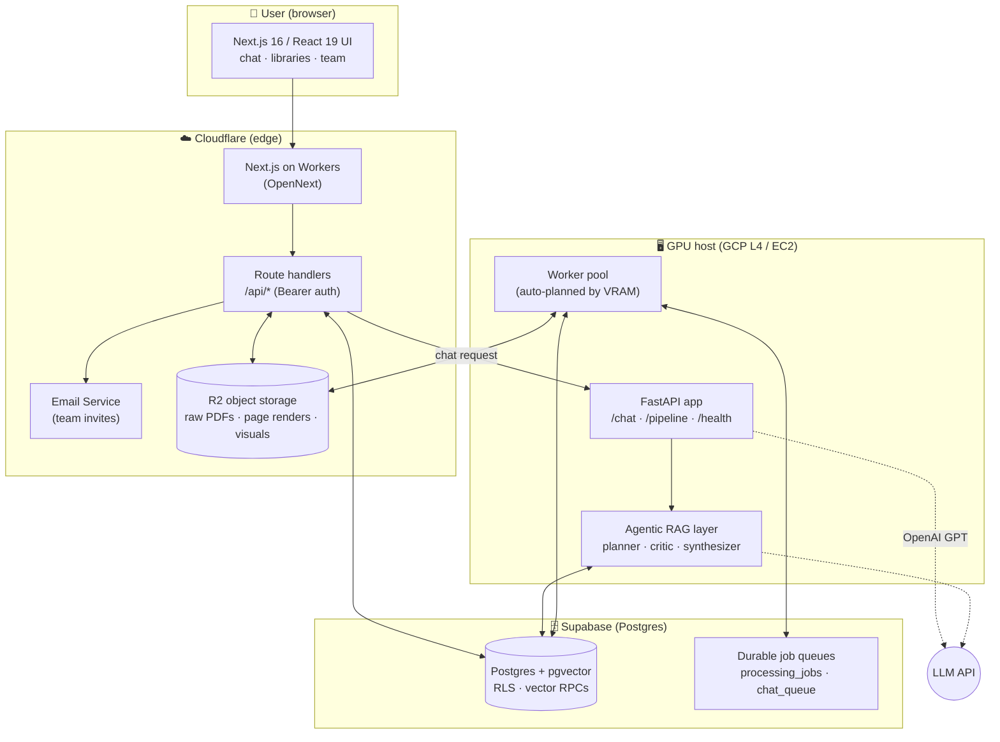
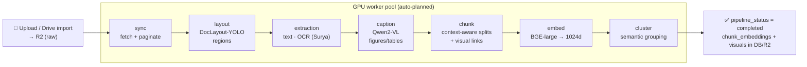

<div align="center">

# 🧠 Synapse

### An agentic, citation-grounded document-AI platform for your knowledge base

Turn a pile of PDFs into a multi-tenant research assistant that **plans**, **retrieves across documents**, **verifies its own completeness**, and answers with **inline figures and source-anchored citations** — not just a single embedding lookup.

[](https://nextjs.org)
[](https://react.dev)
[](https://fastapi.tiangolo.com)
[](https://supabase.com)
[](https://workers.cloudflare.com)
[](https://www.typescriptlang.org)

</div>

---

## Table of contents

- [What is Synapse?](#what-is-synapse)
- [Why it's different](#why-its-different)
- [Feature tour](#feature-tour)
- [System architecture](#system-architecture)
- [The agentic retrieval pipeline](#the-agentic-retrieval-pipeline)
- [The document-understanding pipeline](#the-document-understanding-pipeline)
- [Data model](#data-model)
- [Tech stack](#tech-stack)
- [Repository layout](#repository-layout)
- [Getting started](#getting-started)
- [Deployment](#deployment)
- [Configuration](#configuration)
- [Roadmap](#roadmap)
- [Research lineage](#research-lineage)
- [License](#license)

---

## What is Synapse?

**Synapse** is a full-stack platform that ingests documents (PDFs, Google Drive imports), understands their *layout* — paragraphs, headings, tables, figures, charts, formulas — and lets teams **chat with their knowledge base**. Every answer is grounded in the source material, cites the exact chunks it used, and can embed the relevant figures and tables **inline** in the response.

It is **multi-tenant** (organizations, members, roles), supports **team collaboration** (explicit per-library sharing + shared team chats spanning independent organizations), and is built to run cheaply on serverless edge + a single GPU instance.

> Built and maintained as a deep, production-grade system: an edge frontend, a GPU document-processing backend, a durable job queue, and a multi-agent RAG layer derived from current research.

---

## Why it's different

Most "chat with your PDF" tools do one embedding search and paste chunks into a prompt. Synapse treats answering as an **agentic process**:

| Most RAG demos | Synapse |
|---|---|
| Single top-k vector search | **Query-class router** picks a strategy (spotlight / multi-hop / comparison / aggregation / multi-entity) |
| One shot, no follow-up | **Curiosity loop** generates bridging sub-questions and stops early when evidence is sufficient |
| Hope the context is enough | **Completeness critic** detects missing entities/attributes and gap-fills before answering |
| Text only | **Layout-aware ingestion** extracts tables/figures/charts and re-embeds them **inline** in answers |
| "Source: document.pdf" | **Chunk-level citations** with hover-to-verify context |
| Plain chunk dump | **Distilled evidence brief** (Extractor) before synthesis |

---

## Feature tour

- **🔎 Agentic, adaptive retrieval** — Planner → Retriever → Extractor → curiosity hops → completeness critic → Synthesizer.
- **🧭 Thinking modes** — `Fast` / `Balanced` / `Deep` trade latency for reasoning depth (hop count, critic rounds, sub-queries, answer length).
- **🖼️ Inline visuals** — figures, tables, and charts pulled from the source PDFs are embedded directly in the answer with explanations.
- **📌 Verifiable citations** — every claim links back to the source chunk; hover to preview the cited passage in context.
- **💬 Live agent status** — the UI streams what the agent is doing (planning, retrieving, critiquing, synthesizing).
- **🧵 Thread lineage** — long conversations auto-continue into linked child threads when the context window fills, with a connected sidebar timeline.
- **👥 Team collaboration** — invite teammates by email (Cloudflare Email), share specific libraries, and chat together over a pooled, **cross-organization** knowledge base. Personal chats stay private.
- **⚙️ Durable processing pipeline** — document ingestion runs as a resumable, multi-stage job queue on a GPU host with automatic worker planning.
- **🏢 Multi-tenant** — organizations, members, roles, and Postgres Row-Level Security throughout.

---

## System architecture

Synapse is split into three planes: an **edge frontend**, a **GPU backend**, and **shared state** (Postgres + object storage). The frontend never talks to the GPU directly for ingestion — it enqueues durable jobs that workers drain.



**Flow at a glance**

1. **Upload / import** → the frontend stores the raw file in **R2** and enqueues a `library_preprocess` job in **Postgres**.
2. **Workers** on the GPU host claim jobs stage-by-stage (layout → extraction → captioning → chunking → embedding → clustering), writing results back to Postgres + R2.
3. **Chat** → the frontend proxies the question to the FastAPI **`/chat`** endpoint, which runs the **agentic pipeline** against pgvector, then streams a grounded, cited answer with inline visuals.

---

## The agentic retrieval pipeline

The chat layer is a multi-agent orchestrator inspired by **MA-RAG**, **CuriousLLM**, and completeness-focused evaluation (**MEBench**). Simple questions take a fast single-hop path; hard ones fan out.

```
                          user prompt + conversation
                                     │
                                     ▼
                        ┌────────────────────────┐
                        │  1. PLANNER             │  classify query class →
                        │  (adaptive router)      │  SPOTLIGHT · MULTI_HOP ·
                        │                         │  COMPARISON · AGGREGATION ·
                        └───────────┬─────────────┘  MULTI_ENTITY · CONVERSATIONAL
                                    │ decompose → sub-queries
                                    ▼
                        ┌────────────────────────┐
                        │  2. RETRIEVER           │  pgvector cosine (BGE-large 1024d)
                        │  (parallel fan-out)     │  + lexical fallback
                        │                         │  + cross-encoder rerank
                        │                         │  + neighbor-chunk expansion
                        └───────────┬─────────────┘
                                    ▼
                        ┌────────────────────────┐
                        │  3. EXTRACTOR           │  distill retrieved chunks into a
                        │                         │  source-anchored evidence brief
                        └───────────┬─────────────┘
                                    ▼
                        ┌────────────────────────┐
                        │  4. CURIOSITY LOOP      │  generate bridging follow-up
                        │  (bounded hops)         │  sub-questions; STOP early when
                        │                         │  evidence is SUFFICIENT
                        └───────────┬─────────────┘
                                    ▼
                        ┌────────────────────────┐
                        │  5. COMPLETENESS CRITIC │  any entities/attributes missing?
                        │                         │  → gap-fill retrieval, else proceed
                        └───────────┬─────────────┘
                                    ▼
                        ┌────────────────────────┐
                        │  6. SYNTHESIZER         │  ChatGPT-style formatted answer:
                        │                         │  headings · [[CITE:n]] · [[VISUAL:id]]
                        └───────────┬─────────────┘
                                    ▼
                       grounded answer + cited sources + inline figures
```

**Adaptive routing (why it matters):** plain top-k RAG *degrades* on comparison/aggregation questions because the evidence is scattered across every document, while it helps "spotlight" lookups. The router picks the retrieval strategy per query class instead of using one fixed `k`.

**Thinking modes** map to concrete knobs:

| Mode | Critic rounds | Sub-queries | Breadth | Answer length |
|------|:---:|:---:|:---:|:---:|
| **Fast** | 0 | 0 | 1.0× | concise |
| **Balanced** | 1 | 2 | 1.25× | balanced |
| **Deep** | 2 | 4 | 1.5× | comprehensive |

> Inline markers `[[CITE:n]]` and `[[VISUAL:id]]` are emitted by the synthesizer, resolved server-side to real chunks/visuals, and rendered client-side as citation chips and figure cards.

---

## The document-understanding pipeline

Ingestion is a **resumable, multi-stage job queue**. Each stage is an independent worker process; the pool size is auto-planned from available VRAM. A document survives restarts and picks up where it left off.



| Stage | Worker | What it does |
|------|--------|--------------|
| **Sync** | `sync_worker` | Fetch the source file, render/paginate pages |
| **Layout** | `layout_worker` | Detect regions (text, table, figure, formula) with **DocLayout-YOLO** |
| **Extraction** | `extraction_worker` | Pull text; **Surya** OCR for scanned/visual regions |
| **Caption** | `caption_worker` | Describe figures/tables/charts with **Qwen2-VL** (vision-language) |
| **Chunk** | `chunk_worker` | Context-aware chunking; attach `section_heading`, `context_prefix`, `visual_ids` |
| **Embed** | `embed_worker` | **BGE-large-en-v1.5** → 1024-dim vectors into `chunk_embeddings` |
| **Cluster** | `cluster_worker` | Semantic grouping for retrieval quality |

The pool is orchestrated by `worker_bootstrap.py` (with a cross-platform PID lock to prevent double-starts) and sized by `hardware.py::auto_worker_plan()`.

---

## Data model

Postgres (Supabase) is the single source of truth, with **Row-Level Security** enforced throughout and **pgvector** for similarity search.

| Table | Purpose |
|------|---------|
| `organizations`, `organization_members` | Multi-tenancy + roles (owner/member) |
| `organization_invitations` | Email invites (token + status), accepted server-side |
| `libraries` | Document collections; `created_by_user_id`, `pipeline_status` |
| `team_library_shares` | Explicit per-library sharing into a team |
| `chunk_embeddings` | Text chunks + `vector(1024)` embeddings + rich metadata |
| `processing_jobs`, `batch_stage_jobs` | Durable ingestion queue + per-stage progress |
| `chat_threads`, `chat_messages` | Conversations; `is_team`, thread lineage (`parent_thread_id`, `root_thread_id`) |
| `chat_queue` | Durable retrieval fan-out queue |

**Key RPCs** (pgvector cosine search):
- `match_chunk_embeddings(...)` — org + library scoped search.
- `match_chunk_embeddings_by_libraries(...)` — cross-organization search for pooled team libraries.

See [`docs/database-schema.md`](docs/database-schema.md) and the SQL migrations in [`docs/`](docs/).

---

## Tech stack

**Frontend / Edge**
- Next.js 16 (App Router) · React 19 · TypeScript 5
- Tailwind CSS 4
- Deployed to **Cloudflare Workers** via **OpenNext** (`@opennextjs/cloudflare`)
- `react-markdown` + `remark-gfm` + KaTeX (math) for rich answer rendering
- `@react-three/fiber` / `three` for visual flourishes
- Supabase JS (auth + data), Cloudflare **R2** (storage), Cloudflare **Email Service** (invites)

**Backend / GPU**
- Python · **FastAPI** + Uvicorn
- **PyTorch** (CUDA) on a GCP **L4** (`g2-standard-8`) or comparable GPU host
- Models: **DocLayout-YOLO** (layout), **Surya** (OCR), **Qwen2-VL** (vision-language captioning), **BGE-large-en-v1.5** (embeddings), **BGE-reranker** (cross-encoder)
- **OpenAI GPT** (configurable) for the agent reasoning + synthesis layer
- Multiprocessing worker pool with a durable Supabase job queue

**Shared state**
- Supabase **Postgres + pgvector**
- Cloudflare **R2** (S3-compatible object storage)

---

## Repository layout

```
synapse/
├─ app/                      # Next.js App Router
│  ├─ api/                   #   route handlers (backend proxy, library, team, pdf, visual…)
│  ├─ dashboard/             #   main app shell (libraries · chat · team · usage)
│  ├─ team/                  #   invite accept flow
│  └─ auth · login · register · new-organization
├─ components/               # 26 React components
│  ├─ ChatWorkspace.tsx      #   personal ⇄ team chat, in-panel team selector
│  ├─ ChatPanel.tsx          #   chat engine: streaming, citations, library picker, sharing
│  ├─ ChatAnswer / ChatMarkdown / ContextMeter / VisualCard …
│  └─ TeamWorkspace.tsx      #   members · invites · library sharing
├─ backend/                  # FastAPI + GPU worker pool
│  ├─ app.py                 #   entrypoint (HTTP API + worker pool lifecycle)
│  ├─ config.py              #   single source of env-derived config
│  ├─ chat_api.py            #   /chat orchestrator + live status
│  ├─ chat_agents.py         #   planner · critic agents
│  ├─ chat_runtime.py        #   retrieval, rerank, evidence brief, cross-org
│  ├─ pipeline_api.py        #   /pipeline start/status/cancel, /r2/delete-prefix
│  ├─ *_worker.py            #   sync · layout · extraction · caption · chunk · embed · cluster
│  └─ worker_bootstrap.py    #   pool orchestration + locking
└─ docs/                     # design docs, deploy guides, SQL migrations
```

---

## Getting started

### Prerequisites
- Node.js 20+, a Supabase project (with `pgvector`), a Cloudflare account (R2 bucket), an OpenAI API key.
- For ingestion/chat backend: a CUDA GPU host (or run API-only with `WORKERS_ENABLED=0`).

### 1. Frontend (local)

```bash
npm install
# create .env.local with the values listed under "Configuration" below
npm run dev                  # http://localhost:3000
```

### 2. Database

Run the SQL migrations in [`docs/`](docs/) in your Supabase SQL editor (schema, chat persistence, queues, vector RPCs, team collaboration). The schema reference lives in [`docs/database-schema.md`](docs/database-schema.md).

### 3. Backend (GPU host)

```bash
cd backend
python -m venv .venv && source .venv/bin/activate
pip install -r requirements-base.txt -r requirements-gpu.txt
# configure env (see below), then:
uvicorn app:app --host 0.0.0.0 --port 8000
```

Health checks: `GET /health` (liveness), `GET /ready` (config + GPU), `GET /hardware` (worker plan).

---

## Deployment

| Component | Target | Guide |
|----------|--------|-------|
| Frontend | Cloudflare Workers (OpenNext) — auto-deploys on push | [`docs/cloudflare-deploy.md`](docs/cloudflare-deploy.md) |
| Backend | GCP L4 GPU VM (systemd) | [`docs/gcp-deploy.md`](docs/gcp-deploy.md) |
| Backend (alt) | AWS / RunPod | [`docs/aws-deploy.md`](docs/aws-deploy.md) · [`docs/runpod-backend.md`](docs/runpod-backend.md) |
| API reference | every endpoint, request/response | [`docs/backend-api.md`](docs/backend-api.md) |

> Database migrations run **first** in Supabase; then push the frontend; then deploy the backend.

---

## Configuration

**Frontend** (`.env.local`)

```bash
NEXT_PUBLIC_SUPABASE_URL=...
NEXT_PUBLIC_SUPABASE_ANON_KEY=...
SUPABASE_SERVICE_ROLE_KEY=...           # server routes only
GOOGLE_CLIENT_ID=...                    # Drive import (optional)
GOOGLE_CLIENT_SECRET=...
TEAM_INVITE_FROM=invites@yourdomain.com # Cloudflare Email sender
BACKEND_CHAT_TIMEOUT_MS=240000
```

**Backend** (environment)

```bash
SUPABASE_URL=...            SUPABASE_SERVICE_ROLE_KEY=...
R2_ENDPOINT=...  R2_BUCKET=...  R2_ACCESS_KEY=...  R2_SECRET_KEY=...
OPENAI_API_KEY=...          CHAT_GPT_MODEL=...        # configurable
EMBED_MODEL=BAAI/bge-large-en-v1.5
VIS_QWEN_MODEL=Qwen/Qwen2-VL-2B-Instruct
DOCLAYOUT_YOLO_REPO=juliozhao/DocLayout-YOLO-DocStructBench
FRONTEND_ORIGIN=https://yourapp.com,http://localhost:3000
WORKERS_ENABLED=1           # 0 = API-only (no GPU pool)
HF_HOME=/opt/hf-cache       # persistent model cache
```

> ⚠️ Never commit real secrets. Only public `NEXT_PUBLIC_*` values belong in committed env files.

---

## Roadmap

- [x] Multi-stage GPU ingestion pipeline (layout → embed → cluster)
- [x] Agentic retrieval (planner · curiosity hops · completeness critic · synthesizer)
- [x] Inline visuals + chunk-level citations
- [x] Team collaboration (cross-org sharing, shared chats, email invites)
- [ ] Roles & permissions hardening, leave-team flows
- [ ] BM25 / Postgres FTS hybrid retrieval
- [ ] Evaluation harness (entity-attribute F1 for completeness)
- [ ] Self-host-friendly model packaging

---

## Research lineage

The retrieval layer is adapted from an analytical reading of recent work (see [`docs/retrieval-pipeline-design.md`](docs/retrieval-pipeline-design.md)):

- **MA-RAG** — multi-agent collaborative RAG (Planner / Extractor / QA).
- **CuriousLLM** — curiosity-driven follow-up questions + early termination.
- **Loong** — retrieval must adapt to task type (RAG can hurt comprehensiveness).
- **Multi-Document Financial QA** — semantic tagging; numbers live in tables.
- **MEBench** — *completeness* (covering all entities/attributes) is the real failure mode.

---

## License

[Add a license, e.g. MIT] — see `LICENSE`.

<div align="center">

**Synapse** — built solo, end to end: edge runtime, GPU pipeline, durable queue, and a multi-agent RAG brain.

</div>
