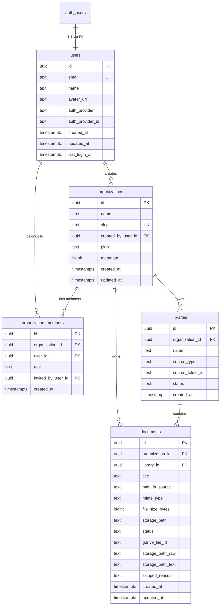

# Synapse Database Schema

Documentation of all Supabase database tables, their schemas, indexes, and RLS policies.

---

## 1. `public.users`

User profiles linked to Supabase Auth.

### Schema

```sql
CREATE TABLE public.users (
  id UUID NOT NULL,
  email TEXT NOT NULL,
  name TEXT NULL,
  avatar_url TEXT NULL,
  auth_provider TEXT NULL,
  auth_provider_id TEXT NULL,
  created_at TIMESTAMP WITH TIME ZONE NULL DEFAULT now(),
  updated_at TIMESTAMP WITH TIME ZONE NULL DEFAULT now(),
  last_login_at TIMESTAMP WITH TIME ZONE NULL,
  
  CONSTRAINT users_pkey PRIMARY KEY (id),
  CONSTRAINT users_email_key UNIQUE (email),
  CONSTRAINT users_id_fkey FOREIGN KEY (id) REFERENCES auth.users (id) ON DELETE CASCADE
) TABLESPACE pg_default;
```

### Indexes

```sql
CREATE INDEX IF NOT EXISTS idx_users_auth_provider_id 
  ON public.users USING btree (auth_provider, auth_provider_id) TABLESPACE pg_default;
```

### RLS Policies

| Policy Name | Operation | Check |
|-------------|-----------|-------|
| (default)   | ALL       | `auth.uid() = id` |

---

## 2. `public.organizations`

Organizations that own libraries and documents.

### Schema

```sql
CREATE TABLE public.organizations (
  id UUID NOT NULL DEFAULT gen_random_uuid(),
  name TEXT NOT NULL,
  created_at TIMESTAMP WITH TIME ZONE NULL DEFAULT now(),
  slug TEXT NULL,
  created_by_user_id UUID NULL,
  plan TEXT NULL DEFAULT 'free'::text,
  metadata JSONB NULL DEFAULT '{}'::jsonb,
  updated_at TIMESTAMP WITH TIME ZONE NULL DEFAULT now(),
  
  CONSTRAINT organizations_pkey PRIMARY KEY (id),
  CONSTRAINT organizations_slug_key UNIQUE (slug),
  CONSTRAINT organizations_created_by_user_id_fkey FOREIGN KEY (created_by_user_id) REFERENCES users (id) ON DELETE RESTRICT
) TABLESPACE pg_default;
```

### Indexes

```sql
CREATE INDEX IF NOT EXISTS idx_organizations_slug 
  ON public.organizations USING btree (slug) TABLESPACE pg_default;
```

### RLS Policies

*None specified*

---

## 3. `public.organization_members`

Membership linking users to organizations with roles.

### Schema

```sql
CREATE TABLE public.organization_members (
  id UUID NOT NULL DEFAULT gen_random_uuid(),
  organization_id UUID NOT NULL,
  user_id UUID NOT NULL,
  role TEXT NOT NULL DEFAULT 'member'::text,
  created_at TIMESTAMP WITH TIME ZONE NULL DEFAULT now(),
  invited_by_user_id UUID NULL,
  
  CONSTRAINT organization_members_pkey PRIMARY KEY (id),
  CONSTRAINT organization_members_invited_by_user_id_fkey FOREIGN KEY (invited_by_user_id) REFERENCES users (id) ON DELETE SET NULL,
  CONSTRAINT organization_members_organization_id_fkey FOREIGN KEY (organization_id) REFERENCES organizations (id) ON DELETE CASCADE
) TABLESPACE pg_default;
```

### Indexes

```sql
CREATE INDEX IF NOT EXISTS idx_org_members_org 
  ON public.organization_members USING btree (organization_id) TABLESPACE pg_default;

CREATE UNIQUE INDEX IF NOT EXISTS idx_org_members_unique 
  ON public.organization_members USING btree (organization_id, user_id) TABLESPACE pg_default;

CREATE INDEX IF NOT EXISTS idx_org_members_user 
  ON public.organization_members USING btree (user_id) TABLESPACE pg_default;
```

### RLS Policies

*None specified*

---

## 4. `public.libraries`

Document libraries belonging to organizations.

### Schema

```sql
CREATE TABLE public.libraries (
  id UUID NOT NULL DEFAULT gen_random_uuid(),
  organization_id UUID NOT NULL,
  name TEXT NOT NULL,
  source_type TEXT NOT NULL,
  source_folder_id TEXT NOT NULL,
  status TEXT NOT NULL DEFAULT 'pending'::text,
  created_at TIMESTAMP WITH TIME ZONE NULL DEFAULT now(),
  
  CONSTRAINT libraries_pkey PRIMARY KEY (id),
  CONSTRAINT libraries_organization_id_fkey FOREIGN KEY (organization_id) REFERENCES organizations (id) ON DELETE CASCADE
) TABLESPACE pg_default;
```

### Indexes

*None specified*

### RLS Policies

*None specified*

---

## 5. `public.processing_jobs`

Queue table for async pipeline work (sync, extraction, embedding).

### Schema

```sql
CREATE TABLE public.processing_jobs (
  id UUID NOT NULL DEFAULT gen_random_uuid(),
  organization_id UUID NOT NULL,
  library_id UUID NULL,
  type TEXT NOT NULL,
  status TEXT NOT NULL DEFAULT 'queued'::text,
  payload JSONB NOT NULL DEFAULT '{}'::jsonb,
  attempts INTEGER NOT NULL DEFAULT 0,
  run_after TIMESTAMP WITH TIME ZONE NULL,
  last_error TEXT NULL,
  created_at TIMESTAMP WITH TIME ZONE NULL DEFAULT now(),
  updated_at TIMESTAMP WITH TIME ZONE NULL DEFAULT now(),

  CONSTRAINT processing_jobs_pkey PRIMARY KEY (id),
  CONSTRAINT processing_jobs_org_fkey FOREIGN KEY (organization_id) REFERENCES organizations (id) ON DELETE CASCADE,
  CONSTRAINT processing_jobs_library_fkey FOREIGN KEY (library_id) REFERENCES libraries (id) ON DELETE SET NULL
) TABLESPACE pg_default;
```

### Indexes

```sql
CREATE INDEX IF NOT EXISTS idx_processing_jobs_status 
  ON public.processing_jobs USING btree (status, run_after) TABLESPACE pg_default;

CREATE INDEX IF NOT EXISTS idx_processing_jobs_org 
  ON public.processing_jobs USING btree (organization_id) TABLESPACE pg_default;
```

### RLS Policies

*None specified*

---

## 6. `public.drive_connections`

Organization-level OAuth tokens for Google Drive.

### Schema

```sql
CREATE TABLE public.drive_connections (
  id UUID NOT NULL DEFAULT gen_random_uuid(),
  organization_id UUID NOT NULL,
  provider TEXT NOT NULL DEFAULT 'google_drive',
  refresh_token TEXT NOT NULL,
  access_token TEXT NULL,
  token_expires_at TIMESTAMP WITH TIME ZONE NULL,
  created_at TIMESTAMP WITH TIME ZONE NULL DEFAULT now(),
  updated_at TIMESTAMP WITH TIME ZONE NULL DEFAULT now(),

  CONSTRAINT drive_connections_pkey PRIMARY KEY (id),
  CONSTRAINT drive_connections_org_fkey FOREIGN KEY (organization_id) REFERENCES organizations (id) ON DELETE CASCADE
) TABLESPACE pg_default;
```

### Indexes

```sql
CREATE UNIQUE INDEX IF NOT EXISTS idx_drive_connections_org
  ON public.drive_connections USING btree (organization_id);
```

### RLS Policies

*None specified*

---

## (Pipeline Additions) Vector Search + Clustering

These tables power the post-chunking stages:
`embedding` (pgvector) + `clustering` (KMeans/HDBSCAN later).

> Note: You must enable the pgvector extension once per database:
>
> ```sql
> create extension if not exists vector;
> ```

### 7. `public.chunk_embeddings`

Chunk-level embedding store (pgvector). This is the primary retrieval table.

```sql
CREATE TABLE public.chunk_embeddings (
  chunk_id TEXT NOT NULL,
  organization_id UUID NOT NULL,
  library_id UUID NOT NULL,
  doc_id UUID NOT NULL,
  chunk_index INTEGER NOT NULL DEFAULT 0,
  page_start INTEGER NULL,
  page_end INTEGER NULL,
  section_heading TEXT NULL,

  text TEXT NULL,
  context_prefix TEXT NULL,
  embedding_text TEXT NULL,

  embedding_model TEXT NOT NULL,
  embedding_dim INTEGER NULL,
  embedding vector(1024) NOT NULL,

  cluster_id INTEGER NULL,

  visual_ids JSONB NOT NULL DEFAULT '[]'::jsonb,
  visual_keys JSONB NOT NULL DEFAULT '[]'::jsonb,

  updated_at TIMESTAMP WITH TIME ZONE NULL DEFAULT now(),

  CONSTRAINT chunk_embeddings_pkey PRIMARY KEY (chunk_id),
  CONSTRAINT chunk_embeddings_org_fkey FOREIGN KEY (organization_id) REFERENCES organizations (id) ON DELETE CASCADE,
  CONSTRAINT chunk_embeddings_library_fkey FOREIGN KEY (library_id) REFERENCES libraries (id) ON DELETE CASCADE,
  CONSTRAINT chunk_embeddings_doc_fkey FOREIGN KEY (doc_id) REFERENCES documents (id) ON DELETE CASCADE
);
```

Indexes:

```sql
CREATE INDEX IF NOT EXISTS idx_chunk_embeddings_library
  ON public.chunk_embeddings USING btree (library_id);

CREATE INDEX IF NOT EXISTS idx_chunk_embeddings_library_cluster
  ON public.chunk_embeddings USING btree (library_id, cluster_id);

-- Vector index (choose one)
-- IVF_FLAT (good default)
CREATE INDEX IF NOT EXISTS idx_chunk_embeddings_vec_ivfflat
  ON public.chunk_embeddings USING ivfflat (embedding vector_cosine_ops) WITH (lists = 100);

-- Or HNSW (often best quality/speed, uses more memory)
-- CREATE INDEX IF NOT EXISTS idx_chunk_embeddings_vec_hnsw
--   ON public.chunk_embeddings USING hnsw (embedding vector_cosine_ops) WITH (m = 16, ef_construction = 128);
```

### 8. `public.library_clusters`

Per-library cluster centroids and stats (used for diversification/routing/UI).

```sql
CREATE TABLE public.library_clusters (
  organization_id UUID NOT NULL,
  library_id UUID NOT NULL,
  cluster_id INTEGER NOT NULL,
  size INTEGER NOT NULL DEFAULT 0,
  centroid vector(1024) NOT NULL,
  summary TEXT NULL,
  representative_chunk_ids JSONB NOT NULL DEFAULT '[]'::jsonb,
  updated_at TIMESTAMP WITH TIME ZONE NULL DEFAULT now(),

  CONSTRAINT library_clusters_pkey PRIMARY KEY (library_id, cluster_id),
  CONSTRAINT library_clusters_org_fkey FOREIGN KEY (organization_id) REFERENCES organizations (id) ON DELETE CASCADE,
  CONSTRAINT library_clusters_library_fkey FOREIGN KEY (library_id) REFERENCES libraries (id) ON DELETE CASCADE
);

CREATE INDEX IF NOT EXISTS idx_library_clusters_org
  ON public.library_clusters USING btree (organization_id, library_id);
```

### 9. `public.library_cluster_runs`

Library-level idempotency + locking for clustering (so only one worker clusters a library).

```sql
CREATE TABLE public.library_cluster_runs (
  library_id UUID NOT NULL,
  organization_id UUID NOT NULL,
  status TEXT NOT NULL DEFAULT 'running',
  started_at TIMESTAMP WITH TIME ZONE NULL DEFAULT now(),
  finished_at TIMESTAMP WITH TIME ZONE NULL,
  last_error TEXT NULL,
  updated_at TIMESTAMP WITH TIME ZONE NULL DEFAULT now(),

  CONSTRAINT library_cluster_runs_pkey PRIMARY KEY (library_id),
  CONSTRAINT library_cluster_runs_org_fkey FOREIGN KEY (organization_id) REFERENCES organizations (id) ON DELETE CASCADE,
  CONSTRAINT library_cluster_runs_library_fkey FOREIGN KEY (library_id) REFERENCES libraries (id) ON DELETE CASCADE
);
```


---

## 7. `public.documents`

Individual documents stored within libraries.

### Schema

```sql
CREATE TABLE public.documents (
  id UUID NOT NULL DEFAULT gen_random_uuid(),
  organization_id UUID NOT NULL,
  library_id UUID NOT NULL,
  title TEXT NOT NULL,
  path_in_source TEXT NULL,
  mime_type TEXT NULL,
  file_size_bytes BIGINT NULL,
  storage_path TEXT NULL,
  status TEXT NOT NULL DEFAULT 'pending'::text,
  created_at TIMESTAMP WITH TIME ZONE NULL DEFAULT now(),
  gdrive_file_id TEXT NULL,
  storage_path_raw TEXT NULL,
  storage_path_text TEXT NULL,
  skipped_reason TEXT NULL,
  updated_at TIMESTAMP WITH TIME ZONE NULL DEFAULT now(),
  
  CONSTRAINT documents_pkey PRIMARY KEY (id),
  CONSTRAINT documents_library_id_fkey FOREIGN KEY (library_id) REFERENCES libraries (id) ON DELETE CASCADE,
  CONSTRAINT documents_organization_id_fkey FOREIGN KEY (organization_id) REFERENCES organizations (id) ON DELETE CASCADE
) TABLESPACE pg_default;
```

### Indexes

```sql
CREATE INDEX IF NOT EXISTS idx_documents_library 
  ON public.documents USING btree (library_id) TABLESPACE pg_default;

CREATE INDEX IF NOT EXISTS idx_documents_org_lib_status 
  ON public.documents USING btree (organization_id, library_id, status) TABLESPACE pg_default;

CREATE INDEX IF NOT EXISTS idx_documents_gdrive 
  ON public.documents USING btree (gdrive_file_id) TABLESPACE pg_default
  WHERE (gdrive_file_id IS NOT NULL);
```

### RLS Policies

*None specified*

---

## Entity Relationship Diagram



---

## Known Issues

### User Registration Failing

The `public.users` table has RLS enabled with policy `auth.uid() = id`. This blocks INSERT operations during signup because:

1. Supabase Auth creates a user in `auth.users`
2. A trigger (if exists) tries to insert into `public.users`
3. RLS blocks because `auth.uid()` is not set during the trigger execution

**Fix:** Add an INSERT policy that allows the trigger/service role to insert:

```sql
-- Allow service role (triggers) to insert

Individual documents stored within libraries.

### Schema

```sql
CREATE TABLE public.documents (
  id UUID NOT NULL DEFAULT gen_random_uuid(),
  organization_id UUID NOT NULL,
  library_id UUID NOT NULL,
  title TEXT NOT NULL,
  path_in_source TEXT NULL,
  mime_type TEXT NULL,
  file_size_bytes BIGINT NULL,
  storage_path TEXT NULL,
  status TEXT NOT NULL DEFAULT 'pending'::text,
  created_at TIMESTAMP WITH TIME ZONE NULL DEFAULT now(),
  gdrive_file_id TEXT NULL,
  storage_path_raw TEXT NULL,
  storage_path_text TEXT NULL,
  skipped_reason TEXT NULL,
  updated_at TIMESTAMP WITH TIME ZONE NULL DEFAULT now(),
  
  CONSTRAINT documents_pkey PRIMARY KEY (id),
  CONSTRAINT documents_library_id_fkey FOREIGN KEY (library_id) REFERENCES libraries (id) ON DELETE CASCADE,
  CONSTRAINT documents_organization_id_fkey FOREIGN KEY (organization_id) REFERENCES organizations (id) ON DELETE CASCADE
) TABLESPACE pg_default;
```

### Indexes

```sql
CREATE INDEX IF NOT EXISTS idx_documents_library 
  ON public.documents USING btree (library_id) TABLESPACE pg_default;

CREATE INDEX IF NOT EXISTS idx_documents_org_lib_status 
  ON public.documents USING btree (organization_id, library_id, status) TABLESPACE pg_default;

CREATE INDEX IF NOT EXISTS idx_documents_gdrive 
  ON public.documents USING btree (gdrive_file_id) TABLESPACE pg_default
  WHERE (gdrive_file_id IS NOT NULL);
```

### RLS Policies

*None specified*

---

## Entity Relationship Diagram


---

## Known Issues

### User Registration Failing

The `public.users` table has RLS enabled with policy `auth.uid() = id`. This blocks INSERT operations during signup because:

1. Supabase Auth creates a user in `auth.users`
2. A trigger (if exists) tries to insert into `public.users`
3. RLS blocks because `auth.uid()` is not set during the trigger execution

**Fix:** Add an INSERT policy that allows the trigger/service role to insert:

```sql
-- Allow service role (triggers) to insert
CREATE POLICY "Service role can insert users" ON public.users
  FOR INSERT TO service_role WITH CHECK (true);

-- OR allow authenticated users to insert their own row
CREATE POLICY "Users can insert own profile" ON public.users
  FOR INSERT TO authenticated WITH CHECK (auth.uid() = id);
```

---

## 8. `public.library_sources`

Stores source-specific credentials and metadata (e.g., Google Drive folder IDs and tokens) for each library.

### Schema

```sql
CREATE TABLE public.library_sources (
  id UUID NOT NULL DEFAULT gen_random_uuid(),
  organization_id UUID NOT NULL,
  library_id UUID NOT NULL,
  provider TEXT NOT NULL DEFAULT 'google_drive',
  folder_id TEXT NOT NULL,
  folder_name TEXT NULL,
  refresh_token TEXT NOT NULL,
  access_token TEXT NULL,
  token_expires_at TIMESTAMP WITH TIME ZONE NULL,
  created_at TIMESTAMP WITH TIME ZONE NULL DEFAULT now(),
  updated_at TIMESTAMP WITH TIME ZONE NULL DEFAULT now(),
  
  CONSTRAINT library_sources_pkey PRIMARY KEY (id),
  CONSTRAINT library_sources_library_fkey FOREIGN KEY (library_id) REFERENCES libraries (id) ON DELETE CASCADE,
  CONSTRAINT library_sources_org_fkey FOREIGN KEY (organization_id) REFERENCES organizations (id) ON DELETE CASCADE,
  CONSTRAINT library_sources_unique_lib UNIQUE (library_id, organization_id)
) TABLESPACE pg_default;
```

---

## 9. `public.extraction_batches`

Manages batches of documents assigned to extraction workers.

### Schema

```sql
CREATE TABLE public.extraction_batches (
  id UUID NOT NULL DEFAULT gen_random_uuid(),
  organization_id UUID NOT NULL,
  library_id UUID NOT NULL,
  status TEXT NOT NULL DEFAULT 'queued'::text, -- queued, running, done, error
  doc_ids JSONB NOT NULL DEFAULT '[]'::jsonb, -- Array of document UUIDs
  assigned_worker TEXT NULL,
  started_at TIMESTAMP WITH TIME ZONE NULL,
  finished_at TIMESTAMP WITH TIME ZONE NULL,
  error TEXT NULL,
  created_at TIMESTAMP WITH TIME ZONE NULL DEFAULT now(),
  
  CONSTRAINT extraction_batches_pkey PRIMARY KEY (id),
  CONSTRAINT extraction_batches_library_fkey FOREIGN KEY (library_id) REFERENCES libraries (id) ON DELETE CASCADE,
  CONSTRAINT extraction_batches_org_fkey FOREIGN KEY (organization_id) REFERENCES organizations (id) ON DELETE CASCADE
) TABLESPACE pg_default;
```

### Indexes

```sql
CREATE INDEX IF NOT EXISTS idx_extraction_batches_status 
  ON public.extraction_batches USING btree (status) TABLESPACE pg_default;
```
